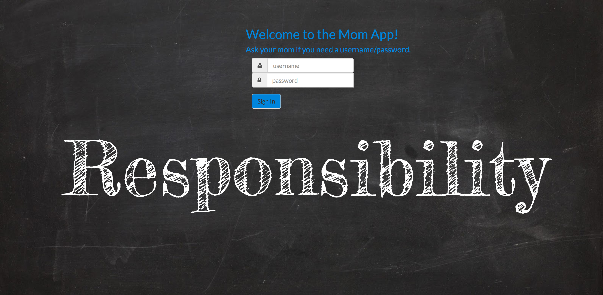
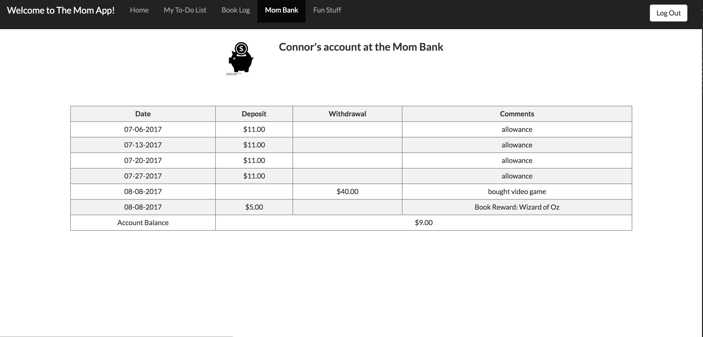

# My solo project for Prime Digital Academy - The Mom App

The objective of this assignment is to create an application in two weeks that uses full stack software
development tools taught at Prime.

## Summary

As a very busy parent, I have a hard time keeping track of my children’s activities, chores, and other responsibilities.  I've tried making printable spreadsheets in excel or using pre-made chore checklists but they get lost and kids lose motivation...kids these days are into digital formats and apps.  So I designed the Mom App as a way for myself to keep track of my children’s responsibilities in a way that is easy to access, fun, and hold kids accountable to earn their allowance.  Now I don't have to nag my kids to practice their music lessons every day, they have the Mom App as motivation to complete their responsibilities to earn rewards.

Update post Prime:
- August 7, 2017:  
I'm very excited to get back to the Mom App post graduation.  While the app had full functionality and instructor feedback was, "You should be proud of this app, it's great work!", I wanted to improve and add some more features.  Every day I am learning new things and want to implement those features in the Mom App to improve it.  I've revamped the styling with additional Bootstrap UI formats and added a feature for my kids to earn additional rewards for reading books over the summer.  My son replied with a groan that he didn't want to have to read more books, which is exactly why I'm using a reward system to motivate him.  After the book feature is complete, I will be deploying the Mom App for my kids and me to use.  It's really going to be fun to see this app in action!
- August 9, 2017:  
All features I currently want to try out when I deploy on Heroku are functioning.  My next step is to implement Grunt and minimize code on a develop branch and then merge into master once I verify I did not break anything in the process.  Ideally, I'd like to implement some testing but that may have to wait until next week.  We touched on testing at Prime but I need to really dive into and educate myself more about the different techniques and best practices.
- August 10, 2017:
Grunt installed and scripts minimized, quick and easy process to do.
- August 11, 2017:
Test version of The Mom App has been deployed on Heroku.  This app was intended just as a personal app to be used by myself and family so I do not have it set up for the public to register or use.  I have one person set as an admin who can then set up users and their passwords.  I could refactor code and database setup to allow someone to register and then set up a family/household but not the best use of my time right now.  Maybe a future goal if friends or others express interest in using this app.

Test version:
- Feel free to play around, this is only a test version and not real data.  I will be deploying a separate version for my children to use.  Use the following link and username/password for initial login as an admin.  You can then set up some users/passwords, task and bank data.  From there you can login as one of the users you created and play around with the user functions.

http://themomapp-test.herokuapp.com/#/home
username: admin
password: admin

## Application Features
###  Login

###  Admin Home Page
- set up users and passwords, allowance, family calendar link, task items for each user

###  Admin Bank Page
- make allowance deposits and withdrawals

###  Admin Bonus Reward Page
- approve reward when users submit book summaries

### Approve modal
- enter award amount, upon selecting save the amount gets deposited in user's account in the mom bank

###  User Home Page
- user logs in and sees a pie chart of their completed chores and family calendar

###  User Checklist Page
 - users are able to check off chores they complete, progress bar at bottom

### User Book Log
 - user is able to enter book info and summary which gets submitted for mom approval to earn rewards

### Add Book modal

### User Mom Bank Account Page
 - user is able to see allwances/rewards and also how much money they withdrew and how they spent their savings

## Technologies Used

* Mongo
* Express.js
* AngularJS
* Node.js
* HTML5
* CSS3
* Bootstrap/Bootstrap UI
* Passport.js
* Chart.js
* X-editable AngularJS
* Sweetalert
* Heroku

## Author

Barbara King

## Acknowledgments

Prime Digital Academy Instructor Kris Szafranski for providing the Passport Code Base.
Prime Digital Academy Instructors Millie Walsh, Dev Jana, Huck Brock, and Luke Schlangen for their on-going support.
